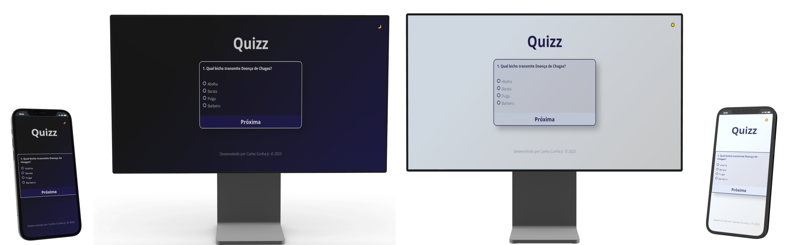

#  [Quizz](https://carloscunha611.github.io/countdown-timer/)

    

> Este é um aplicativo de quizz de conhecimentos gerais desenvolvido utilizando as tecnologias JavaScript, CSS e HTML.

## Funcionalidades e descrições

- Site otimizado para acesso em dispositivos móveis, tablets e desktops.
- Funcionalidade de troca de tema entre claro e escuro.
- Pontuação final.
- Design limpo e simples.

    

## ⚙ Tecnologias

- HTML5
- CSS3
- JavaScript
- Git / GitHub

## 🔗 Portfólio e links

  
  

